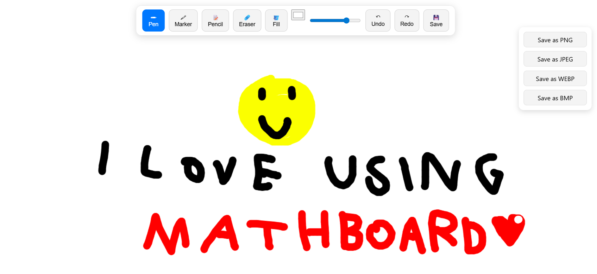

# MathBoard
Simple whiteboard for math projects in VSCode

## Features

- Like Miro or Microsoft whiteboard , You can use pencil - marker and fill tool.
- Support export image as `JPG` - `PNG` - `WEBM` - `BMP`.
- Very light and convenient for weak machines.
- Easy to use

#### Screenshot :

### Credits
[0xSaad](https://x.com/0xdonzdev)
